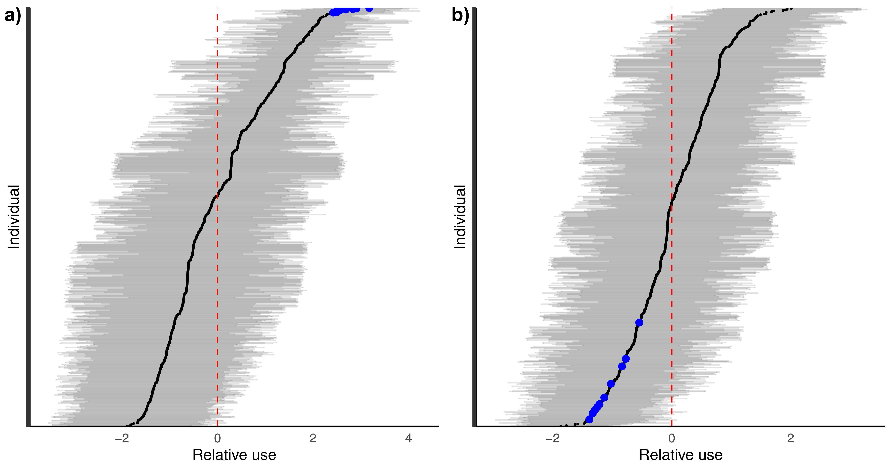
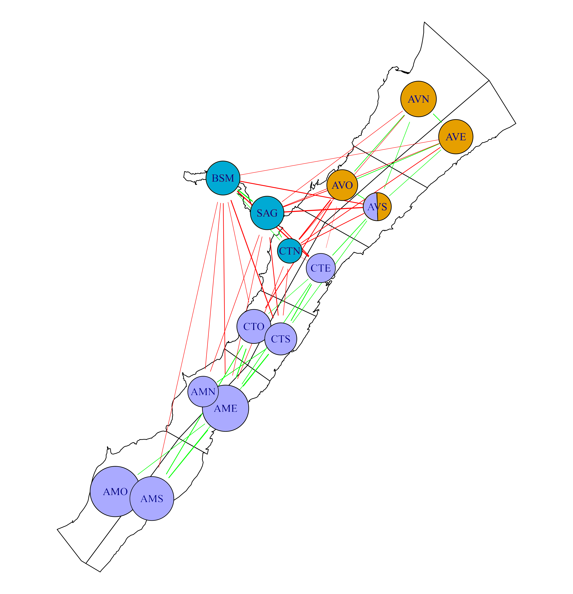

# Extracting socio-spatial networks from photo-ID data using multilevel multinomial models
 

### Abstract: 
&nbsp;&nbsp;&nbsp;&nbsp;&nbsp;&nbsp;Photo identification of individuals within a population is a common data source that is becoming more common given technological advances and the use of computer vision and machine learning to re-identify individuals. These data are collected through hand-held cameras, drones, and camera traps, and often come with biases in terms of sampling effort and distribution. In spite of these biases a common goal of collecting these datasets is to better understand the habitat use pattern of individuals and populations. Here, we examine the potential for multilevel multinomial models to generate socio-spatial networks that capture the similarities in individual users across the spatial distribution of a species. We use this approach with 18 years of photo-ID data to better understand population structuring of beluga whales in the St. Lawrence River. We show using permuted and simulated data that this approach can identify community network structures within populations in a way that accounts for biases in collections methods. Applying this method to the entire 18 years dataset for SLE beluga, we found three spatially distinct communities. These results suggest that within the population’s summer range individuals are moving within restricted areas (i.e., home ranges), and have implications for the estimated impacts of localized anthropogenic stressors, such as chemical pollution or acoustic disturbances on animal populations. We conclude that multilevel multinomial models can be effective at estimating socio-spatial networks that describe community structuring within wildlife populations. 
 
 
### Code:

 In this paper we used brms to build and run a multilevel multinomial model to create socio-spatial networks. See [this link](https://github.com/tbonne/photoID_multinomial/blob/main/R/multinomial_code.Rmd) for more detailed code, but below is the general formula used:
 
  bf(y | trials(totsize) ~ 1 + (1|p|ID)) + multinomial()
  
 Here 'y' is a column vector with the number of times a beluga was seen in each sector of the St. Lawrence Estuary. 'Totsize' is the total number of times that beluga was seen, and 'ID' is the individual beluga ID number. The additional 'p' in the random effects formula (1|p|ID) allows correlations between individual random intercepts (i.e., beluga usage patterns) to be calculated between sectors.
 
 
### Visualizations:
 We can visualize these correlations between beluga usage patterns (i.e., similarities in individual random intercepts) between sectors:
 
 
 
 *Figure 1: Estimate of the relative use (i.e., deviation from mean use) for each individual within the SAG (a) and CTE sectors (b) of the St. Lawrence beluga summer habitat. The values are deviations from the mean probability of observing individuals within a sector and are on the logit scale. The red dashed line represents the mean use, black points represent the estimated deviation from the mean, while the horizontal grey lines represent the 95% credible interval. To highlight how correlations are estimated between sectors, the estimated top 10 users of the SAG sector are represented by blue dots (panel a), and those same individuals are also highlighted in blue in the CTE sector (panel b).*
 
 
 We also use these between sector correlations to create a socio-spatial network defining similarity/dissimilarity in beluga usage patterns within the St.Lawrence Estuary:
 
 

*Figure 4: Similarity and dissimilarity between sectors in the beluga whale population of the St. Lawrence. The green edges between two sectors signify that the sectors share high/low users, while red edges signify that they have dissimilar high/low users. The lack of an edge signifies that the high/low users of one sector does not provide information about the high/low users of other sectors. Nodes represent sectors, and are coloured based on shared communities: i.e., shared green edges, and no red edges. Node sizes represent the magnitudes of individual differences in use within the sector, i.e., larger nodes suggest larger differences between high and low users.*
